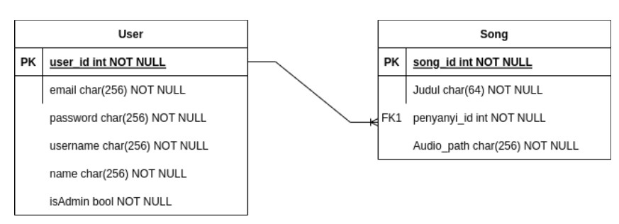

# Binotify REST

## Deskripsi Web Service

Web service merupakan aplikasi yang berisi sekumpulan basis data (database) dan perangkat lunak (software) atau bagian dari program perangkat lunak yang diakses secara remote oleh piranti dengan perantara tertentu. Melalui web service, memungkinkan pengguna untuk mengatasi permasalahan berupa interoperability dan mengintegrasikan sistem berbeda.

REST atau Representational State Transfer adalah salah satu gaya arsitektur yang dapat diadaptasikan ketika membangun web service. Arsitektur ini sangat populer digunakan karena pengembangannya yang relatif mudah. Ia menggunakan pola request-response dalam berinteraksi, artinya ia memanfaatkan protokol HTTP.
Dalam implementasinya arsitektur REST benar-benar memisahkan peran client dan server, bahkan keduanya tidak harus saling mengetahui. Artinya ketika terjadi perubahan besar di sisi client, tidak akan berdampak pada sisi server, begitu juga sebaliknya.

Pada tugas besar ini, kami menggunakan REST untuk menangani segala proses yang berhubungan dengan artis premium dari Binotify App maupun Binotify Premium.

## Skema basis data yang digunakan

## Contributors

Here are the list of contributors by functionalities worked on.

Backend Binotify Premium Autentikasi : 13520112
Backend Binotify Premium Pengelolaan Lagu Premium : 13520166
Backend Binotify Premium Endpoint List Penyanyi : 13520063
Backend Binotify Premium Endpoint List Lagu dari Penyanyi : 13520063
